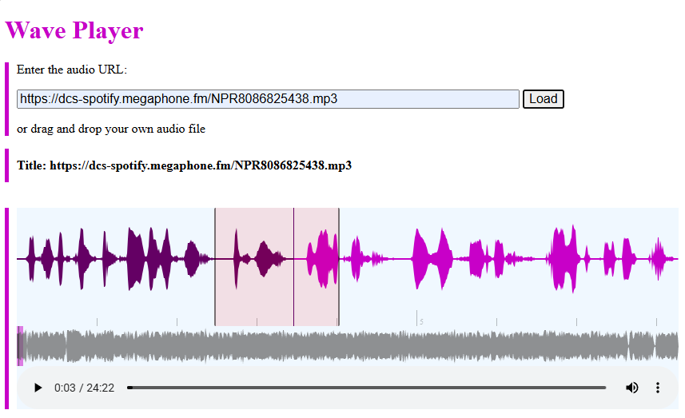

# Wave Player - English Language Learning Audio Player

**Description:**

Wave Player is a web-based audio player designed specifically for English Language Learning. It features a visual waveform representation of the audio, allowing users to easily select and repeat specific segments for focused study.  It also supports direct playback of online audio without requiring downloads.

**Features:**

* **Waveform Visualization:**  A clear visual representation of the audio waveform makes it easy to identify and select specific sections.
* **Segment Repeat:**  Users can select a portion of the audio waveform and loop it for repeated listening, ideal for practicing pronunciation or focusing on specific phrases.
* **Online Audio Playback:** Play audio directly from online sources without needing to download the files.
* **Intuitive Interface:** A simple and user-friendly design makes it easy to use for learners of all levels.

**Shortcuts:**

* Space: toggle play and pause
* 'f': play in 2x speed
* 'n': play in 1x speed
* 's': play in 0.5 speed
* 'u': speed up
* 'd': speed down
* 'Delete': delete the region
* 'Esc': exit the loop of the region
* left:  backward 15 seconds
* right: forward 15 seconds

**Quick Install**
* Download the project.
* Open index.html in your browser.

**TODO**
- [ ] Electron app
- [x] overlay the loading spinner during loading 
- [x] directly drop to the player

**Issues**
* Cannot open audio from a web site that does not allows a web page to access resources from a different domain than the one that served the page, i.e. Cross-origin resource sharing (CORS).

**Demo**

<video src='./assets/demo.mp4' > 